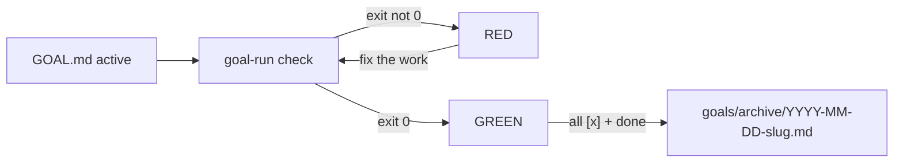

# goal-run

Markdown checklists do not fail. Agents still tick them and say `done`.
This CLI runs the verifier you named: RED (exit 1) or GREEN (exit 0), with the evidence on disk.
`done` refuses a self-grade. That is why you install it instead of another todo list.

**Run until done.** A tiny CLI that turns `GOAL.md` into a state machine with a **separate verifier** — so agents stop declaring victory on vibes.

```bash
pip install -e .                 # or: pip install "git+https://github.com/Olie0512/goal-run"
goal-run init "Ship public MVP"  # writes GOAL.md
# …do the work, tick boxes…
goal-run check                   # RED or GREEN — runs the shell commands you named
goal-run done                    # all boxes + last verifier exit 0 → archive
```

No account. No paid API. No model inside the CLI. `python -m goal_run` works the same as `goal-run`.

## Why

Coding agents love opening work and hate finishing it. Loops discover; Goals finish. `goal-run` is the finish primitive: one objective, one checklist, one verifier, then an archive file you can point at.

## Quickstart (≤30s)

Requires Python 3.11+.

```bash
git clone https://github.com/Olie0512/goal-run.git
cd goal-run
# A venv is recommended — and required on some systems (~5s): python3 -m venv .venv && source .venv/bin/activate
pip install -e .
goal-run check --goal tests/fixtures/check_fail.md   # RED  (exit 1)
goal-run check --goal tests/fixtures/check_pass.md   # GREEN (exit 0)
```

That is the whole product: **red → green → (tick every box) → archive**.

`uvx` after a git install:

```bash
uvx --from "git+https://github.com/Olie0512/goal-run" goal-run --help
```

This repo is not published to PyPI yet. Do not `pip install goal-run` from PyPI and expect this project.

## Commands

| Command | What it does |
| --- | --- |
| `goal-run init [objective]` | Scaffold `GOAL.md` + `goals/archive/` |
| `goal-run status` | Parse objective, checklist counts, last evidence |
| `goal-run check [--json]` | Run `verifier` shell commands; write `.goal-run/last-check.json`. `--json` prints `{ok, exit_code, checks, evidence}` on stdout (human text on stderr). RED=1, GREEN=0. |
| `goal-run done` | Archive **only if** every checkbox is ticked **and** the last verifier exited 0 |
| `goal-run archive` | Move a completed (or `--force`) GOAL to `goals/archive/YYYY-MM-DD-<slug>.md` |

`done` refuses a self-grade: ticking boxes is not enough, and a missing verifier is not enough. You must have run `goal-run check` and it must have been GREEN. `done` then re-runs the verifier so the last exit code is fresh.

## GitHub Action

Fails the job when `goal-run check` is RED (exit 1). Pin `@v0.1.1` once that tag exists (or a commit SHA until then).

```yaml
goal:
  runs-on: ubuntu-latest
  steps:
    - uses: actions/checkout@v4
    - uses: Olie0512/goal-run/.github/actions/check@v0.1.1
```

Same check as a reusable workflow: `uses: Olie0512/goal-run/.github/workflows/check.yml@v0.1.1`.

Inputs: `goal` (default `GOAL.md`), `timeout`, `python-version`, `json` (default true → `check --json`).

## GOAL.md schema

Frontmatter is optional in the sense that fields can also live under `##` headings. A body is required.

```markdown
---
status: active          # active | blocked | completed
slug: ship-public-mvp
objective: One sentence plus a verifiable done condition.
verifier:
  - pytest -q
---

## Checklist

- [ ] Implement the change
- [ ] Prove it with the verifier

## Non-goals

- Cloud sync
- An LLM inside this CLI

## Progress

- 2026-09-19: initialized
```

`verifier` is a shell command or a list of them. They run with `cwd` = the directory that contains `GOAL.md`. Exit 0 is the only green. A command that starts with `python` or `python3` is executed with the same interpreter as `goal-run` (so fixtures work on images that only ship `python3`).

## Red → green → archive

```text
GOAL.md (active)
    │
    ▼
goal-run check ── exit ≠ 0 ──► RED ── fix ──┐
    │                                       │
    └── exit 0 ──► GREEN ◄──────────────────┘
                      │
          all boxes [x] + evidence
                      │
                      ▼
                 goal-run done
                      │
                      ▼
        goals/archive/YYYY-MM-DD-<slug>.md
              (status: completed)
```



Try it without touching your own `GOAL.md`:

```bash
# RED
goal-run check --goal tests/fixtures/check_fail.md
# GREEN
goal-run check --goal tests/fixtures/check_pass.md
# refuse (open boxes)
goal-run done --goal tests/fixtures/incomplete.md
```

## Record a GIF / asciinema (optional)

Generating a binary GIF in CI is brittle, so this repo ships a recorder instead of a checked-in movie.

```bash
# once: pip install asciinema   (or brew install asciinema)
./scripts/record-demo.sh
# then, if you want a GIF:
#   agg demo.cast demo.gif     # https://github.com/asciinema/agg
```

See `scripts/record-demo.sh`. Commit `demo.cast` / `demo.gif` only if you generated them locally — they are gitignored by default.

## Principles

- One objective, one checklist, one verifier
- **Verifier ≠ implementer** — `done` refuses a self-grade without passing check evidence
- Archive when complete; never leave a mid-gap `GOAL.md` pretending to be finished

## Non-goals

Not an agent framework. Not a task UI. Not SaaS. Not a star-farming scheme. v1 has no cloud sync, no auth, no model.

## Tests & CI

```bash
pip install -e ".[dev]"
pytest
ruff check src tests
```

CI runs pytest (including parse tests on every fixture `GOAL.md`) and ruff on Ubuntu / Python 3.11 and 3.12.

## License

MIT. See [LICENSE](LICENSE).
